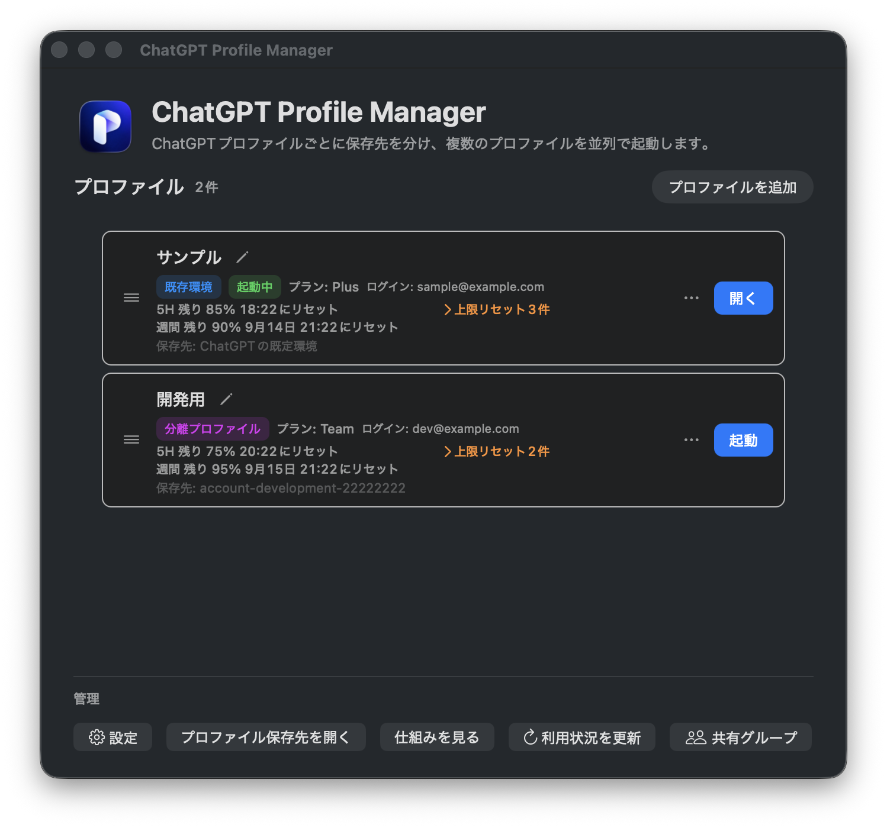
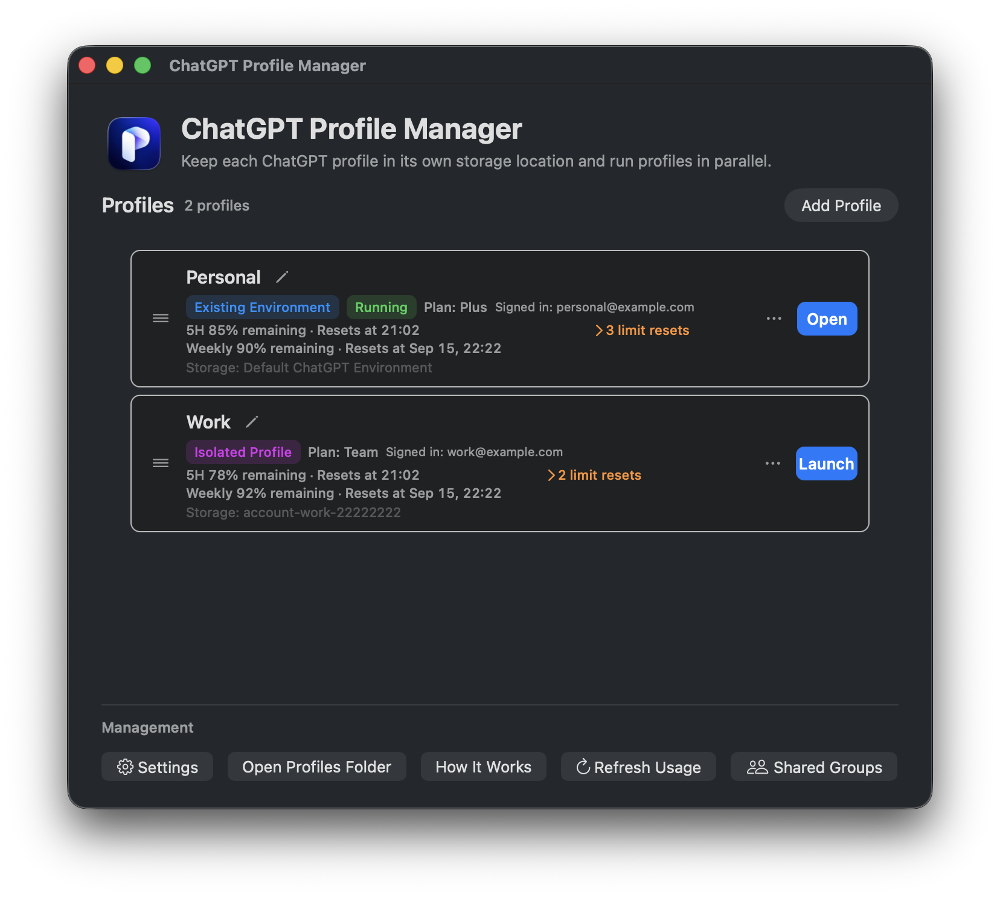

# ChatGPT Profile Manager for Mac

ChatGPTデスクトップアプリのローカル環境を、プロファイルごとに分けて管理するmacOSアプリです。複数のChatGPTアカウントを、それぞれ独立したログイン状態・チャット・プロジェクト・Codex環境で使用できます。

ChatGPT Profile Manager is a macOS app for managing separate local environments for the ChatGPT desktop app. Each profile can keep its own sign-in state, chats, projects, and Codex data so that multiple ChatGPT accounts can be used independently.

**バージョン / Version:** 1.1.0（macOS 14以降 / macOS 14 or later）

> **非公式アプリ / Unofficial app**
> OpenAIまたはChatGPTの公式製品ではありません。OpenAIの名称・ロゴなど第三者の商標・素材は、このリポジトリのMIT Licenseの対象外です。
> This project is not an official OpenAI or ChatGPT product. OpenAI and ChatGPT names, logos, and other third-party marks or assets are not covered by this repository's MIT License.

## 画面イメージ / Screenshot

<p align="center">
  
  
</p>

左が日本語表示、右が英語表示です。画面に表示されているプロファイル名、メールアドレス、利用状況などは説明用のモックデータです。実際のアカウント情報ではありません。

The left image shows the Japanese UI and the right image shows the English UI. The profile names, email addresses, usage figures, and other values shown are mock data for illustration and are not real account information.

## これは何を分けるのか / What is separated

このアプリが分離するのは、macOS上のChatGPT実行環境です。サーバー側のアカウントやOpenAIのクラウドデータを作成・移動するものではありません。

This app separates the local runtime environment on macOS. It does not create, move, or merge server-side accounts or OpenAI cloud data.

| 種類 / Type | 内容 / Behavior |
| --- | --- |
| **ChatGPTの既存環境**<br>Existing ChatGPT environment | ChatGPTが通常使用する既定の保存先を、一覧の1プロファイルに割り当てます。既存のログイン状態、チャット、プロジェクト、設定をそのまま使います。<br>Assigns ChatGPT's normal storage to one profile and keeps its existing sign-in state, chats, projects, and settings. |
| **分離プロファイル**<br>Isolated profile | ChatGPT Profile Managerがプロファイル専用の保存先を作成します。別のアカウントでログインでき、他のプロファイルとローカル状態を分離します。<br>Creates dedicated storage for the profile. You can sign in with another account while keeping local state separate from other profiles. |

分離はアカウント、OSユーザー、サーバー側ワークスペースの境界ではありません。強い分離が必要な場合は、macOSのユーザーアカウントを分けてください。

This is not an account, OS-user, or server-side workspace boundary. Use separate macOS user accounts when you need a stronger boundary.

## 動作要件 / Requirements

- macOS 14以降 / macOS 14 or later
- Apple Silicon（arm64）Mac / Apple Silicon (arm64) Mac
- ChatGPTデスクトップアプリ / ChatGPT desktop app
- 利用状況を表示する場合は、検出可能なCodexコマンドとログイン状態が必要です / Usage information requires a discoverable Codex command and a signed-in profile

## インストール / Install

### 配布版 / Download

リポジトリの配布用アーカイブをダウンロードして展開し、`ChatGPT Profile Manager.app`を`/Applications`へ移動します。

Download the distribution archive from this repository, unpack it, and move `ChatGPT Profile Manager.app` to `/Applications`.

- [macOS用アーカイブ / macOS archive](outputs/ChatGPT-Profile-Manager-macOS.zip)

現在のローカル配布版はad-hoc署名です。初回起動時にmacOSの警告が表示される場合があります。Developer ID署名と公証を行ったリリースは別途提供します。

The current local distribution is ad-hoc signed. macOS may show a warning on first launch. A Developer ID-signed and notarized release will be provided separately.

### Homebrew

Homebrew Caskからインストールできます。

The app is available as a Homebrew Cask:

```sh
brew install --cask octane96/tap/chatgpt-profile-manager
```

既存のインストールを更新する場合は、次のコマンドを使用します。

To update an existing installation, run:

```sh
brew upgrade --cask octane96/tap/chatgpt-profile-manager
```

## クイックスタート / Quick start

1. `ChatGPT Profile Manager.app`を起動します。
   Launch `ChatGPT Profile Manager.app`.
2. 既存のChatGPT環境が見つかった場合、最初のプロファイルがメールアドレスを表示名として自動登録されます。
   If an existing ChatGPT environment is found, the first profile is registered automatically using its email address as the display name.
3. 既存環境がない場合、または追加のプロファイルを作る場合は「プロファイルを追加」を選びます。
   If no existing environment is found, or when adding another profile, choose **Add Profile**.
4. 保存先として、次のいずれかを選びます。
   Choose one of the following storage options:
   - ChatGPTの既存環境を使う / Use the existing ChatGPT environment
   - 新しい分離プロファイルを作る / Create a new isolated profile
   - 既存の分離プロファイルを使う / Use an existing isolated profile
5. 分離プロファイルを初めて起動したときは、その保存先で使うChatGPTアカウントにログインします。
   Sign in to the ChatGPT account you want to use the first time you launch an isolated profile.
6. プロファイル一覧の「起動」を押します。起動中は「開く」に変わり、既存ウィンドウを前面に表示します。異なる保存先のプロファイルは並列起動できます。
   Select **Launch** in the profile list. While running, it changes to **Open** and brings the existing window forward. Profiles with different storage locations can run in parallel.

同じ保存先の二重起動は安全のため防止されます。起動中プロファイルを終了する場合は、そのプロファイルの`…`メニューから「ChatGPTを終了」を選びます。

The same storage location cannot be launched twice. To quit a running profile, choose **Quit ChatGPT** from that profile's `…` menu.

## プロファイルの操作 / Profile operations

メイン画面には日常操作だけを表示します。

The main window shows only everyday actions.

| 状態 / State | Primary action |
| --- | --- |
| 停止中 / Stopped | **起動 / Launch** |
| 起動中 / Running | **開く / Open** |

プロファイル名の横にある鉛筆アイコンでは表示名だけを変更できます。行をドラッグすると一覧の順序を変更できます。

Use the pencil icon next to a profile name to change only its display name. Drag a row to reorder the profile list.

各プロファイルの`…`メニューには、そのプロファイル固有の操作をまとめています。

The `…` menu contains profile-specific management operations:

- Finderで保存先を開く / Open storage in Finder
- Dock用起動アプリを作成・再作成 / Create or recreate a Dock launch app
- 設定の共有、共有設定の管理 / Share settings or manage shared settings
- 別のプロファイルから設定をコピー / Copy settings from another profile
- 最後の設定コピーを復元 / Restore the last settings copy
- プロファイルを診断 / Diagnose the profile
- ChatGPTを終了 / Quit ChatGPT
- プロファイルを削除（分離プロファイルの登録のみ） / Delete the profile registration (isolated profiles only)

既存環境に割り当てたプロファイルは削除できません。分離プロファイルを削除しても、保存フォルダやデータは削除されず、登録情報だけが一覧から外れます。

The profile assigned to the existing environment cannot be deleted. Deleting an isolated profile removes only its registration; its folder and data remain and can be registered again later.

## 保存場所と起動の仕組み / Storage and launch model

分離プロファイルは次の場所に保存されます。

Isolated profiles are stored below:

```text
~/Library/Application Support/ChatGPT Profile Manager/
├── Profiles/
│   └── account-<display-name>-<short-ID>/
│       ├── CodexHome/
│       ├── ElectronUserData/
│       └── .chatgpt-profile-manager-profile.json
├── Settings/
│   ├── SharedSettings/
│   └── Backups/
├── Diagnostics/
│   └── Logs/
├── Recovery/
│   └── RepairSnapshots/
└── SettingsRegistry.json
```

- `CodexHome/`は、`CODEX_HOME`としてCodexの設定、認証、セッション、ログなどに使われます。
  `CodexHome/` is selected as `CODEX_HOME` for Codex settings, authentication, sessions, logs, and related data.
- `ElectronUserData/`は、ChatGPTデスクトップアプリのCookie、ログイン状態、アプリデータに使われます。
  `ElectronUserData/` stores local Electron data for the ChatGPT desktop app, including cookies, sign-in state, and app data.
- 起動時に`CODEX_HOME`、`CODEX_ELECTRON_USER_DATA_PATH`、`--user-data-dir`をプロファイル専用のパスへ指定します。
  At launch, `CODEX_HOME`, `CODEX_ELECTRON_USER_DATA_PATH`, and `--user-data-dir` point to the profile-specific paths.
- アプリは既存環境やクラウド上のプロジェクト・チャットをコピー・移動しません。
  The app does not copy or move the existing environment or cloud projects and chats.
- 保存先フォルダ名には表示名と短いIDを含め、Finderで見分けられるようにしています。
  Folder names include the display name and a short ID so profiles are recognizable in Finder.

`Diagnostics/`と`Recovery/`は診断・修復を実行した場合に作成されます。
`Diagnostics/` and `Recovery/` are created when diagnosis or repair is run.

## 設定の共有とコピー / Share and copy settings

プロファイルの`…`メニューから、設定の共有または一度だけの設定コピーを実行できます。

From a profile's `…` menu, you can share settings continuously or copy them once.

### 設定の共有 / Share settings

共有グループを作成すると、作成元プロファイル自身が参加し、追加するプロファイルと共有項目を選択できます。共有後の変更は参加プロファイルに共通のファイルへ反映されます。

When you create a shared settings group, the source profile joins automatically. Select additional profiles and the settings to share. Later changes are reflected through the shared files for all members.

共有対象は次の4項目です。

The four available items are:

- `AGENTS.md`（指示 / instructions）
- `config.toml`（一般設定 / general configuration）
- `rules`（実行ルール / execution rules）
- `AGENTS.override.md`（上書き指示 / override instructions）

`config.toml`に認証情報、アカウント固有値、または共有対象外の項目が含まれる場合、共有は停止して対象項目を表示します。`rules`はコマンド実行の許可・確認に影響するため、信頼できる内容だけを共有してください。設定変更の前には、参加するすべてのChatGPTを終了してください。

Sharing stops when `config.toml` contains credentials, account-specific values, or unsupported items, and the blocked items are shown. `rules` affects command permission and confirmation behavior, so share it only when trusted. Quit ChatGPT in every participating profile before changing shared settings.

共有グループの名前、参加プロファイル、共有項目、最終更新日時は「設定」内の「共有グループ」で確認できます。

The group name, members, shared items, and last update time are shown under **Shared Groups** in **Settings**.

### 設定をコピー / Copy settings

「別のプロファイルから設定をコピー…」では、コピー元とコピー先（現在のプロファイル）を明示します。実行前に項目ごとの差分を確認できます。

**Copy Settings from Another Profile…** makes the source and destination explicit. A per-item diff is shown before the copy runs.

コピーは一度だけの複製です。コピー先の同名設定は`Settings/Backups/`へバックアップしてから置き換えます。直前のコピーは「最後の設定コピーを復元…」で戻せます。

Copying is a one-time clone. Existing destination settings are backed up under `Settings/Backups/` before replacement. The immediately preceding copy can be restored with **Restore the Last Settings Copy…**.

共有・コピーの対象外 / Never shared or copied:

- `auth.json`、認証情報 / `auth.json` and authentication data
- セッション、ログ、SQLite索引 / sessions, logs, and SQLite indexes
- Cookie、`ElectronUserData` / cookies and `ElectronUserData`
- ChatGPTのチャット、プロジェクト / ChatGPT chats and projects

## プロファイルの診断 / Profile diagnostics

分離プロファイルの`…`メニューから「プロファイルを診断…」を開けます。診断は読み取り中心で、修復を自動実行しません。

Choose **Diagnose Profile…** from an isolated profile's `…` menu. Diagnosis is primarily read-only; it does not automatically repair anything.

診断対象 / Checks include:

- プロファイル保存先の存在・種類・権限 / storage existence, type, and permissions
- `CodexHome`と`ElectronUserData` / `CodexHome` and `ElectronUserData`
- 識別マーカーと設定ファイル / identity marker and settings files
- 設定共有レジストリとシンボリックリンク / settings registry and symbolic links
- SQLiteの`quick_check`、外部キー、対応スキーマ / SQLite `quick_check`, foreign keys, and supported schema
- セッションJSONLの欠落、重複、未索引参照 / missing, duplicate, and unindexed session JSONL references

問題がある場合は「メンテナンス」から次を実行できます。

When findings exist, **Maintenance** provides:

- 保存先を再指定 / Choose the storage location again
- 索引の保守的な修復 / Repair SQLite references conservatively
- 修復ログを表示 / Show repair logs

索引修復では、JSONLのセッションIDとSQLite参照が一意に対応する移動済み参照だけを更新します。推測による行の新規作成や、派生索引の再生成は行いません。変更前のスナップショットと機械可読なログを保存し、失敗時はロールバックします。

Index repair updates only moved references whose JSONL session ID and SQLite row match unambiguously. It does not guess missing rows or rebuild derived indexes. A pre-change snapshot and machine-readable log are saved, and failed transactions are rolled back.

## プロファイル起動用アプリ / Profile launch apps

分離プロファイルの`…`メニューから、そのプロファイル専用の起動用アプリを作成できます。作成したアプリをFinderで表示し、Dockへドラッグしてください。

From an isolated profile's `…` menu, create a launch app dedicated to that profile. Reveal it in Finder and drag it to the Dock.

- アプリ名は`ChatGPT <プロファイル名>.app`です。 / The app is named `ChatGPT <profile-name>.app`.
- プロファイル名から色付きの2文字アイコンを生成します。`ShareFair`、`share-fair`、`share_fair`はいずれも`SF`になります。 / A colored two-letter icon is generated from the profile name. `ShareFair`, `share-fair`, and `share_fair` all become `SF`.
- 異なるプロファイルは並列起動できますが、同じ保存先は二重起動できません。 / Different profiles can run in parallel, but the same storage cannot be launched twice.
- 既存環境プロファイルにはこの項目を表示しません。 / This option is not shown for the existing-environment profile.
- プロファイル名を変更した後は、起動用アプリを再作成して名前とアイコンを更新します。 / Recreate the launch app after renaming a profile to update its name and icon.

起動用アプリはインストール済みのChatGPT.appを呼び出します。ChatGPT.app自体を複製、置換、再署名するものではありません。

Launch apps invoke the installed ChatGPT.app. They do not clone, replace, or re-sign the ChatGPT.app bundle.

## 利用状況と通知 / Usage and notifications

プロファイルカードには、取得できた場合にプラン名、5時間枠、週間枠、上限リセットクレジットを表示します。割合は残りの割合です。

When available, profile cards show the plan, five-hour window, weekly window, and limit-reset credits. Percentages indicate the remaining amount.

- 5H：残り%と24時間表記のリセット時刻 / 5H: remaining percentage and reset time in 24-hour format
- 週間：残り%と月日・24時間表記のリセット時刻 / Weekly: remaining percentage and reset date/time
- 上限リセット：件数と有効期限（複数件は一覧表示） / Limit resets: count and expiration dates

メインウィンドウを閉じても、メニューバーから利用状況を確認できます。メニューバー項目自体は設定から表示・非表示を切り替えられます。初期状態では表示対象プロファイルの最小残量を2行（`5h 33%`、`W 48%`）で表示し、残量表示中はアイコンを表示しません。残量表示をオフにした場合は、`Resources/AppIcon.icns`のP型ロゴを元にした透明背景・単色のメニューバー専用アイコンを表示します。表示はメニューバー内で上下中央に揃え、左右に不要な余白を設けません。ポップオーバーには表示対象プロファイルごとの5H、週間、上限リセット件数と有効期限、最終確認時刻を表示します。上限リセットの詳細は折り畳み（初期状態）で、プロファイルのお気に入り・表示/非表示はメイン画面の設定から変更します。明示的に「終了」した場合はメニューバー項目も終了します。

アプリ起動時、前面表示時、スリープ復帰時、手動更新時に全プロファイルを更新し、通常は15分間隔でも更新します。取得に失敗しても直前の成功値を保持し、失敗状態と最終確認時刻を表示します。

The app remains available from the menu bar after the main window closes. The menu bar item itself can be shown or hidden from Settings. By default, it shows the minimum remaining amount across visible profiles on two lines (`5h 33%` and `W 48%`); no icon is shown while the remaining-usage text is enabled. When the text is disabled, a compact monochrome, transparent-background menu bar icon generated from the P mark in `Resources/AppIcon.icns` is shown instead of the full app icon. The content is vertically centered with no unnecessary left/right padding. Its popover shows each visible profile’s five-hour window, weekly window, limit-reset count and expiration, and last successful check. Limit-reset details are collapsed by default; favorite and visibility are managed from the main window’s settings. Choosing **Quit** explicitly ends the manager and removes the menu bar item.

Usage refreshes at launch, activation, wake, and manual refresh, plus every 15 minutes while running. A failed fetch retains the last successful value and reports the failure separately.

設定では、以下を個別に設定できます（残量表示は初期状態で有効、その他は無効）：

- ログイン時に起動（macOSのログイン項目） / Launch at login (macOS login item)
- 残量25%以下・10%以下の遷移時通知（閾値を再び上回ると再通知可能） / Notifications when remaining usage crosses 25% or 10%; re-armed after recovery
- メニューバーのコンパクト表示（表示中プロファイルの最小残量、初期状態で有効） / Compact menu bar text showing the minimum remaining amount across visible profiles (enabled by default)

表示対象とお気に入りは、各プロファイルの`…`メニューから変更できます。既存の登録は全件表示・お気に入りなしとして移行されます。非表示プロファイルもメイン画面、更新、リセット通知、閾値通知の対象です。

The visibility and favorite flags are available from each profile’s `…` menu. Existing registrations migrate to all-visible, no-favorites defaults. Hidden profiles remain available in the main window and are still included in refreshes and notifications.

Codexコマンドが見つからない、未ログイン、または取得に失敗した場合は`—`と表示します。利用状況や認証情報をこのアプリの設定へ保存しません。

The UI shows `—` when the Codex command is unavailable, the profile is not signed in, or retrieval fails. Usage data and credentials are not saved in this app's settings.

## 設定 / Settings

Settings contains app-wide preferences only:

- 表示言語：Macの設定に従う、日本語、English / Display language: Follow Mac Settings, Japanese, or English
- 利用上限リセットを通知 / Notify when usage limits reset
- メニューバー：メニューバーへの表示、ログイン時起動、コンパクト表示、25%/10%閾値通知 / Menu Bar: show in the menu bar, launch at login, compact status, and 25%/10% threshold notifications
- プロファイル一覧・共有グループの管理情報、ChatGPT.app・Codexコマンドの検出、バックアップ復元 / Management-data health, ChatGPT.app and Codex command detection, and backup restoration
- 共有グループの一覧 / Shared group list

プロファイル固有の共有・コピー・診断・保存先操作は、各プロファイルの`…`メニューにあります。

Profile-specific sharing, copying, diagnosis, and storage actions are in each profile's `…` menu.

## セキュリティとプライバシー / Security and privacy

- このアプリはローカルの保存先を切り替えてChatGPTを起動します。OSのサンドボックスやサーバー側のアカウント分離を提供するものではありません。
  The app launches ChatGPT with selected local storage. It does not provide an OS sandbox or server-side account isolation.
- 認証情報、セッション、チャット、プロジェクトをプロファイル間で自動コピーしません。
  Authentication, sessions, chats, and projects are not automatically copied between profiles.
- 設定共有・コピーでは、設定ファイルやルールに機密値・実行可能な内容が含まれる可能性があります。内容と相手プロファイルを確認してください。
  Shared or copied configuration may contain sensitive or executable content. Review the contents and the destination profiles.
- ChatGPTの利用上限を回避する目的では使用しないでください。
  Do not use this app to circumvent ChatGPT usage limits.

## FAQ

### これはOpenAI公式ですか？ / Is this official?

いいえ。OpenAIとは提携していない非公式アプリです。
No. This is an unofficial app and is not affiliated with OpenAI.

### プロファイルを追加するとアカウントやデータがコピーされますか？ / Does adding a profile copy an account or data?

いいえ。新しい分離プロファイルは空の保存先を作成し、初回起動時にユーザーがログインします。既存環境を選んだ場合も、既存の保存先をそのまま割り当てるだけです。
No. A new isolated profile creates a separate storage location and you sign in on first launch. Choosing the existing environment only assigns its current storage.

### プロファイルを削除するとデータも消えますか？ / Does deleting a profile delete its data?

分離プロファイルの削除は登録解除だけです。保存フォルダは残り、後から「既存の分離プロファイルを使う」で再登録できます。
Deleting an isolated profile unregisters it only. Its folder remains and can be registered again with **Use an Existing Isolated Profile**.

### 複数のChatGPTを同時に起動できますか？ / Can profiles run at the same time?

はい。異なる保存先のプロファイルは並列起動できます。同じ保存先の二重起動はできません。
Yes. Profiles with different storage locations can run in parallel. The same storage location cannot be launched twice.

### CLIとChatGPTアプリが同じアカウントだと保証されますか？ / Does the app verify CLI and ChatGPT account equality?

いいえ。アプリはトークンやCookieを解析してアカウントの同一性を検証しません。各プロファイルで表示されるアカウントをユーザー自身で確認してください。
No. The app does not inspect tokens or cookies to verify account identity. Confirm the account shown in each profile yourself.

## 開発 / Development

```sh
swift test
swift build -c release
```

配布用アプリとZIPは次のスクリプトで作成できます。既存の同名出力がある場合は、スクリプトが上書きを防止して終了します。

Build the app bundle and ZIP with the following script. If an output with the same name already exists, the script exits instead of overwriting it.

```sh
./package-app.sh
```

生成物 / Outputs:

- `outputs/ChatGPT Profile Manager.app`
- `outputs/ChatGPT-Profile-Manager-macOS.zip`

ローカルパッケージはad-hoc署名です。一般公開時はDeveloper ID署名、公証、リリースごとのSHA-256公開を追加してください。

The local package is ad-hoc signed. Public distribution should add Developer ID signing, notarization, and a published SHA-256 checksum for each release.

## ライセンス / License

ソースコードは[MIT License](LICENSE)の下で公開しています。ライセンスの対象はこのリポジトリのソースコードです。ChatGPT、OpenAIの名称・ロゴ、macOSやChatGPTに含まれる第三者の素材・商標は対象外です。

The source code is released under the [MIT License](LICENSE). The license covers the source code in this repository. ChatGPT and OpenAI names and logos, along with third-party assets and trademarks belonging to macOS or ChatGPT, are excluded.
